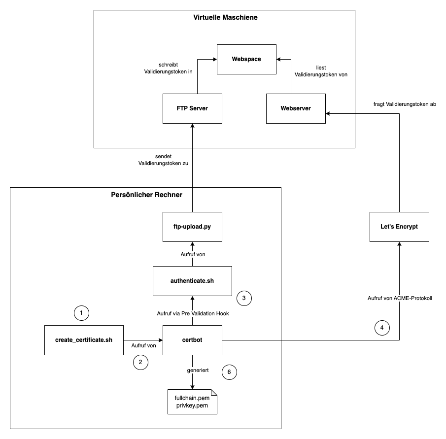

# Let's Encrypt Update

> Skript mit welchem man manuell Let's Encrypt Zertifikate generieren kann

## Übersicht



1. Um ein neues Zertifikat zu erstellen, muss man das `create_certificate.sh` Skript aufrufen.
2. Innerhalb von diesem Skript wird das `certbot` Programm aufgerufen.
3. Für den Aufruf von `certbot` wird ein Pre Validation Hook registiert, welcher nach der Generierung des Validierungstoken aufgerufen wird. Hierbei hat das als Hook aufgerufene Skript Zugriff auf das Validierungstoken und kann es mittels FTP Upload hochladen. 
4. Nach der Ausführung des Pre Validation Hook fährt `certbot` mit seiner Arbeit fort, was dazu führt dass Let's Encrypt prüft ob das Validierungstoken unter der zu zertifizierenden Domain gefunden werden kann.
5. Nach erfolgreicher Prüfung wird das Zertifikat für die Domain ausgestellt, u.a. in Form der Dateien "fullchain.pem" und "privkey.pem".

## Abhängigkeiten

- bash
- certbot
- python3

Das Skript wurde mit macOS getestet, funktioniert aber wahrscheinlich auch auf Linux.

## Nutzung

```sh
export FTP_HOST=161.35.213.167
export FTP_USER=user
export FTP_PASSWORD=xxx

./create_certificate.sh -d letsencrypt-beispiel-1.experimental-software.com,letsencrypt-beispiel-2.experimental-software.com \
    -e jmewes@experimental-software.com
```

## Testen

Um das `create_certificate.sh` Skript zu testen wurde ein Setup erstellt, mit dem man auf der Virtuellen Maschiene (z.B. von [digitalocean.com](https://www.digitalocean.com)) mehrere Webserver für verschiende Websites und einem FTP Server starten kann.

siehe https://github.com/jmewes/lets-encrypt-update-beispiel für Details

## Referenzen

- https://github.com/steinsag/hosteurope-letsencrypt
    - https://github.com/steinsag/hosteurope-letsencrypt/blob/master/verlaengern.py
- https://eff-certbot.readthedocs.io/en/latest/using.html#webroot
- https://xyrillian.de/thoughts/posts/how-i-run-certbot.html
- [Implement a "script" plugin and/or fix manual for scriptability](https://github.com/certbot/certbot/issues/2782)
- https://eff-certbot.readthedocs.io/en/stable/using.html#hooks
